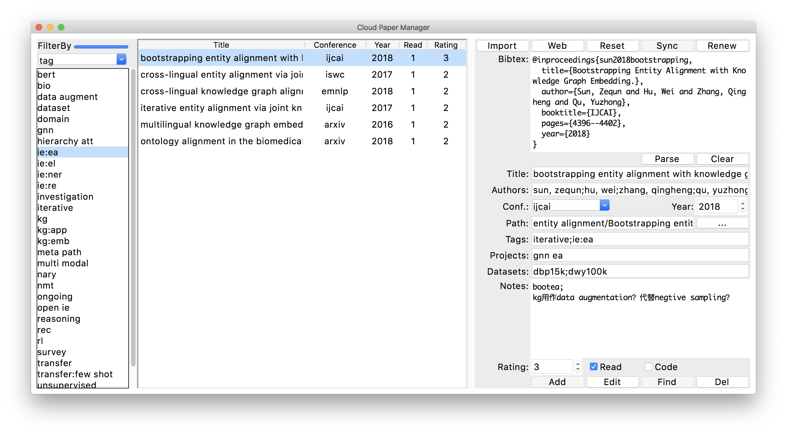

# Cloud Paper Manager

Cloud paper manager is a lightweight research paper management tool across computers, and even across platforms (i.e., Mac, Linux and Windows). You can use any cloud storage service (e.g., dropbox) to synchronize the folder including papers as well as the cloudPaper program, and it will work perfectly as long as the relative paths remains consistent across computers. CloudPaper uses the default python3 packages only, so that you don't need to install additinal packages and deploy the environment.

## How to Run
1. Directly use python to run the cloudPapers.py file by entering the follwing command line in shell:

`python cloudPapers.py`

2. Run the packaged program according to your own system:

**cloudPapers_linux** for Linux (e.g., Ubuntu 16.04)

**cloudPapers_mac** for Mac OS (e.g., Mojave)

3. Package the cloudPapers.py on your own, and run the packaged program.

## Environment

Tested:
1. Mac OS Mojave and python3.6 using anaconda.
2. Ubuntu 16.04 and system default python2.7.

CloudPaper shall support Mac OS, Linux and Windows whatever the python version (2.x or 3.x), but I didn't verify it. The known issue is about the Linux + anaconda, which leads to a ugly font due to tkinter under anaconda cannot link to the system freestyle font config. A solution is using:

`sudo python cloudPapers.py`

or running the packaged program.

## Interface

## Function

There are three areas: Filter (left), Display papers (middle), and Paper Information (right).

### Filter
Filter the papers displayed in the display papers area. support conference, year, author, dataset, tag, project, rating, and others (unread, hasGithub, and needRevise).

Each filter type shall be updated automatically by adding or editing in the paper information area.

There is also a progress bar on the left of 'FilterBy', which shows the ratio of how many papers has been read in current displayed papers.

### Display papers 
The displayed papers can be sorted by clicking the column headings.

Double click is to open the local file accordint its path information.

### Paper Information
CloudPapers maintains its own paper libarary, where each paper has the presented information. **Note the same path point to different papers is not allowed.**

The libarary data can be **sync**hronize into the folder where the program locates, namely 'papers.dat'. Also, the predefined conference file is 'conference.dat', in which each line represents an alias of the conference, separated by tab or four spaces.

#### Import
is to import multiple files (.txt or .pdf) by browsing folders, these files will be automatically added into the libarary with the filter type *needRevise*.

#### Web
is to request bibtex and parse it from google scholar according to the current inputs or selection of the paper information, mainly *title*, *author*, and *year*.

#### Reset
is to clear the filter area, display all papers, and clear the paper information to active *Add* and *Find* button.

#### Sync
is to synchronize the current libarary data into the local 'paper.dat' if there are some updates, which shall be used for initialization when program starts.

#### Renew
is to re-parse each paper's bibtex and update the title, author, conference and year. This has to ensure there are no same filenames even under different folders. It will also check if the paper path exist in the current libarary. If not, these papers will be added into 'needRevise'. It will also watch if there are new files under the current folder, there files shall be added into libaray, same as 'import'.

#### bibtex
is the bibtex of a paper. you can input it or request from google scholar via 'web' button. You can further parse it to fill the below information via 'parse' button, or clear the content via 'clear' button.

If there is no bibtex for a paper, it will automatically generated using the below information.

#### Title, Author, Conference and Year
is the required information to identify the paper, unless the paper is added by 'import' or 'renew', which is under 'FilterBy'-->'others'-->'needRevise'.

#### Path
is also the required information.

#### Tags, Projects, Datasets, Notes, Rating, Read and Code
is the optional information, to further distinguish the paper by 'Filter'. You can input multiple items separated by ';'.

#### Add, Edit, Find, Del
is to manupulate the paper information. Add the current information to library, or find the relavant paper in the current library according to the inputs.

Edit and Del shall be activated only there is a paper selected in the 'display papers', which will disable Add and Find, unless you 'reset'.